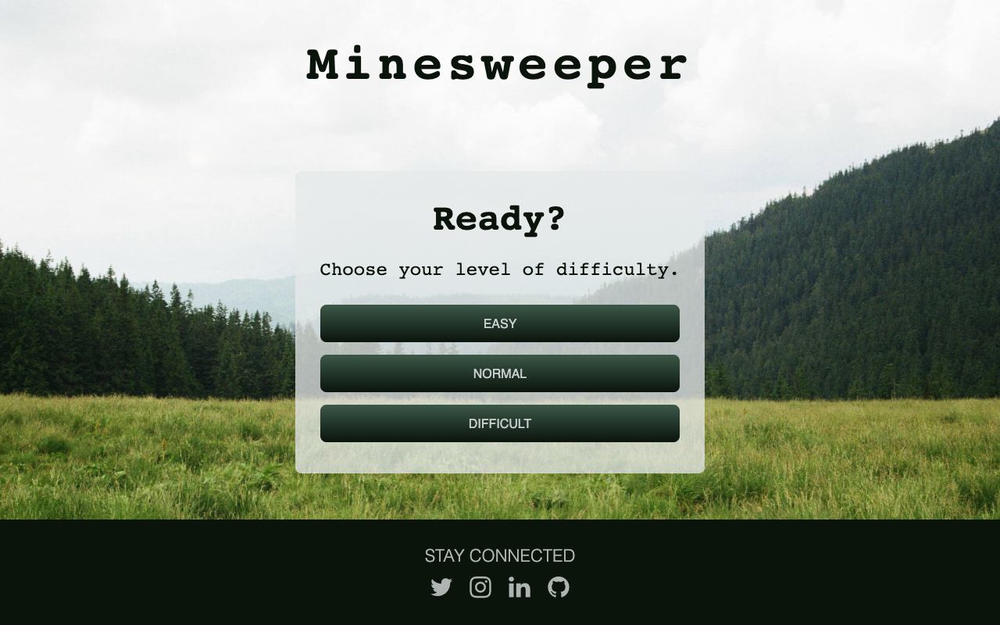

# [Minesweeper](https://frosty-colden-365608.netlify.app/)

This game is a classic and was a ton of fun to design. The app was built as part of my course work for The Iron Yard code bootcamp. The key objectives for this project were:

- Create the app using React.
- Use an [API](http://minesweeper-api.herokuapp.com/) to create the basic game logic.

Enjoy!
