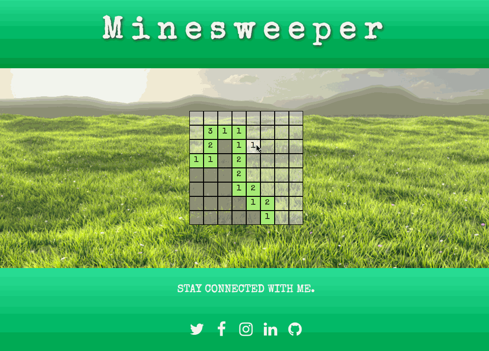

# Minesweeper

This game is a classic and a ton of fun to design. This app was built as part of my course work for [The Iron Yard](https://www.theironyard.com/). The key objectives for this project were

- Create the app using React.
- Use an [API](http://minesweeper-api.herokuapp.com/) to create the basic game logic.

I also used Font Awesome to create the bomb and flag icons for the game.

Enjoy!
